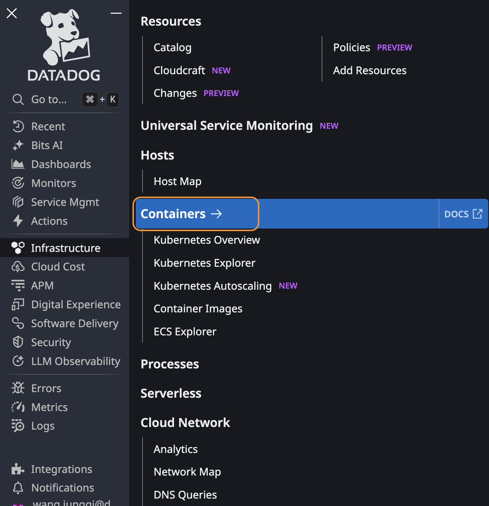
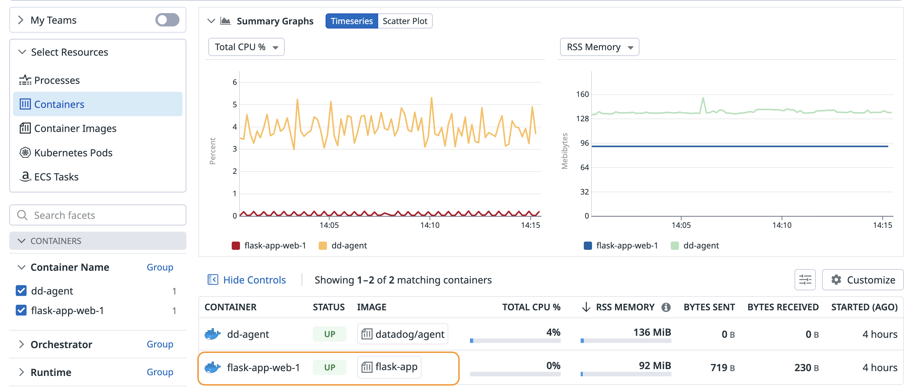
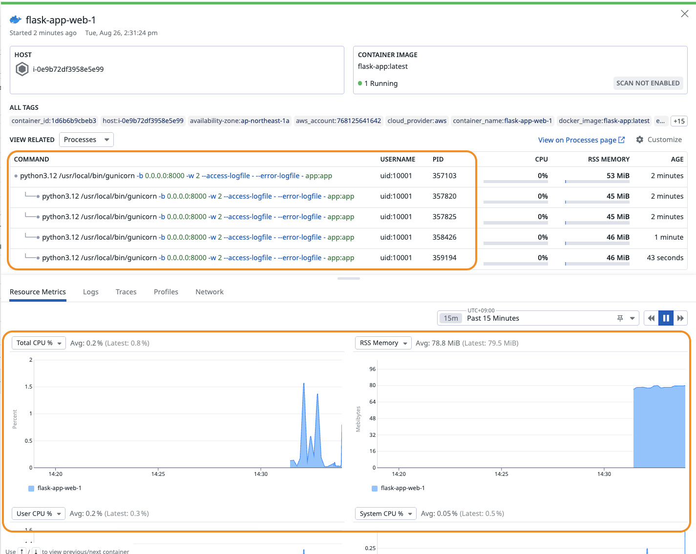
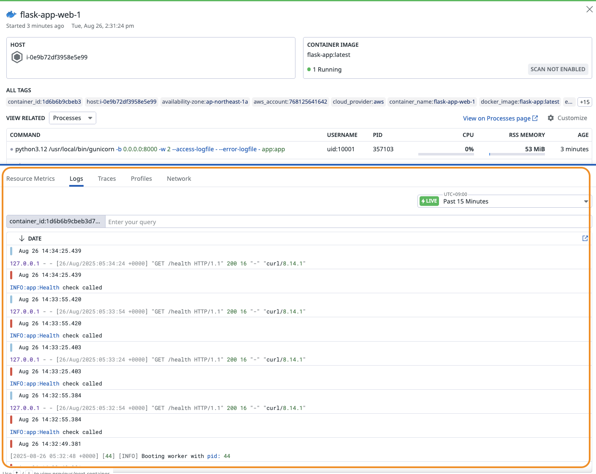
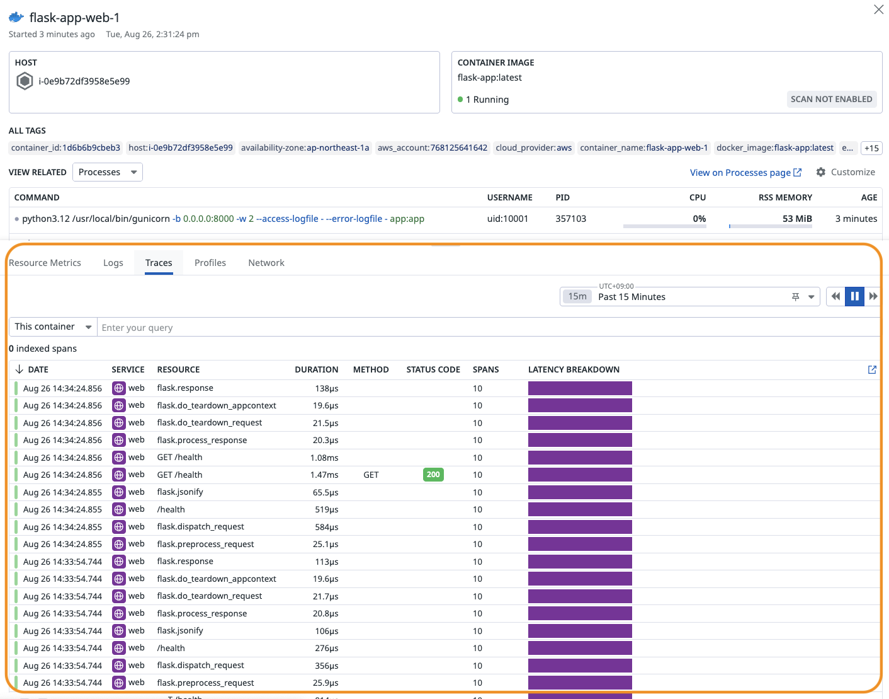
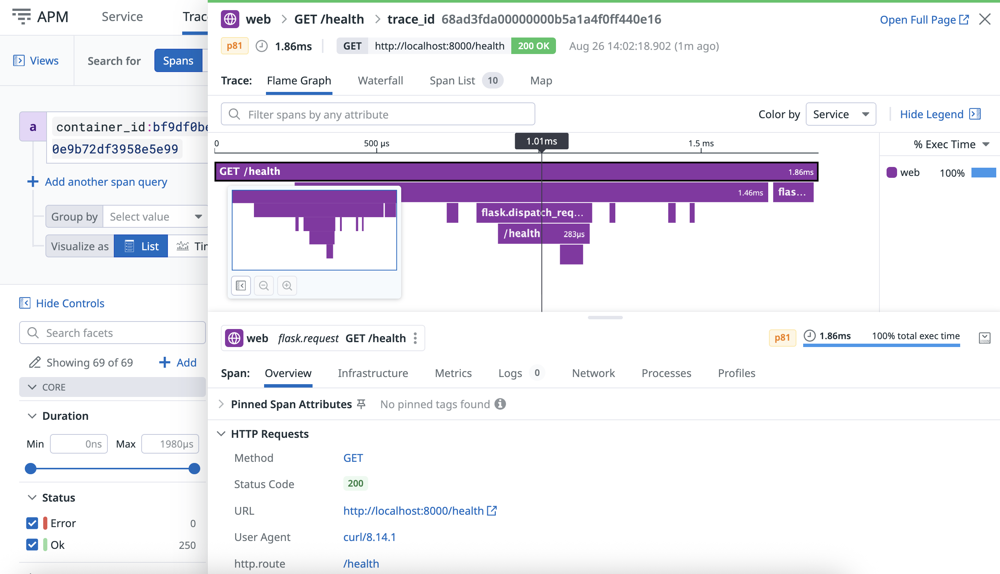

## docker-compose-setup  
このリポはdocker composeを利用したDocker環境向けのDatadogセットアップ(Infra, logs, apm)の方法を例で説明します。  
APMの部分については

### 本リポの構成  
・origin_app: オリジンのComposeによりデプロイするFlaskアプリケーション  
・datadog_installed_app: Datadogのセットアップを実施済みのアプリケーション  
・images: Datadog UI上で動作確認の参照スクリーンショット

### Datadog設定の詳細ステップ  
**Step1** docker-compose.ymlにて、[Datadog Agentのデプロイ定義](https://github.com/dd-japan/docker-compose-setup/blob/8adc0c0ba93ce06caaa053ff246be35d64ffef59/datadog_installed_app/docker-compose.yml#L25C1-L25C11)を追加します。有効化したい機能に応じて、環境変数及びVolumesを調整します。  

**Step2** APMを有効化する際に、以下4点を順番に実施します。  
&nbsp;&nbsp;※2-2と2-3は言語の特性によりやり方が変わる場合があります。今回はPython言語を例で説明します。  
&nbsp;&nbsp;その他サポート言語については[こちら](https://docs.datadoghq.com/tracing/trace_collection/automatic_instrumentation/dd_libraries/)をご参照できます。  

&nbsp;&nbsp;2-1 Step1で、Datadog AgentのコンフィグにAPM有効化に必要な環境変数を設定済み  
&nbsp;&nbsp;2-2 Datadogが言語毎に用意したAPM SDKを依頼に追加。Pythonの例では[requirments.txt](https://github.com/dd-japan/docker-compose-setup/blob/4f7d220e55c65a08401a95b3157c6408793a2bba/datadog_installed_app/requirements.txt#L4)にddtraceを追加しています。  
&nbsp;&nbsp;&nbsp;&nbsp;&nbsp;&nbsp;&nbsp;&nbsp;※DockerfileにRUNコマンドでSDKをダウンロード又はインストールのも可能です。  
&nbsp;&nbsp;2-3 Dockerfileにてアプリケーションの起動コマンドに処理をSDKでラップします。Pythonの例では[Dockerfile](https://github.com/dd-japan/docker-compose-setup/blob/4f7d220e55c65a08401a95b3157c6408793a2bba/datadog_installed_app/Dockerfile#L36)にddtrace-runで起動コマンドをラップしています。  
&nbsp;&nbsp;2-4 docker-compose.ymlにて、アプリケーションの[environments](https://github.com/dd-japan/docker-compose-setup/blob/07826c8f6150d9c36f6122790dc77b7a06d80db4/datadog_installed_app/docker-compose.yml#L11)に必要な環境変数を追加。  

**Step3** Composeを実行し、コンテナの動作確認を行う。  
```bash
$ docker compose ps
NAME              IMAGE                  COMMAND                  SERVICE   CREATED          STATUS                    PORTS
dd-agent          datadog/agent:latest   "/bin/entrypoint.sh"     datadog   15 minutes ago   Up 15 minutes (healthy)   8125/udp, 8126/tcp
flask-app-web-1   flask-app:latest       "ddtrace-run gunicor…"   web       15 minutes ago   Up 15 minutes (healthy)   0.0.0.0:80->8000/tcp, :::80->8000/tcp
```

### Datadog設定後のUI確認手順
**Step1** Datadog UIにてメニューを操作  
  

**Step2** Containerのページに画面遷移  
  

**Step3** アプリケーションコンテナをクリックしてプロセスやメトリクス等の詳細を確認  
  

**Step4** Logsタブに切り替えてコンテナログを確認  
  

**Step5** Tracesタブに切り替えてコンテナのAPMトレース(リクエスト)を確認  
  

**Step6** 任意トレースをクリックし、トレースの詳細呼び出し構造を確認  


### 参照ドキュメント  
・[Docker環境へのAgentセットアップ](https://docs.datadoghq.com/containers/docker/?tab=standard)  
・[ComposeでのAgentセットアップ](https://docs.datadoghq.com/containers/guide/compose-and-the-datadog-agent/)  
・[Composeのオフィシャル設定例](https://github.com/DataDog/docker-compose-example)
